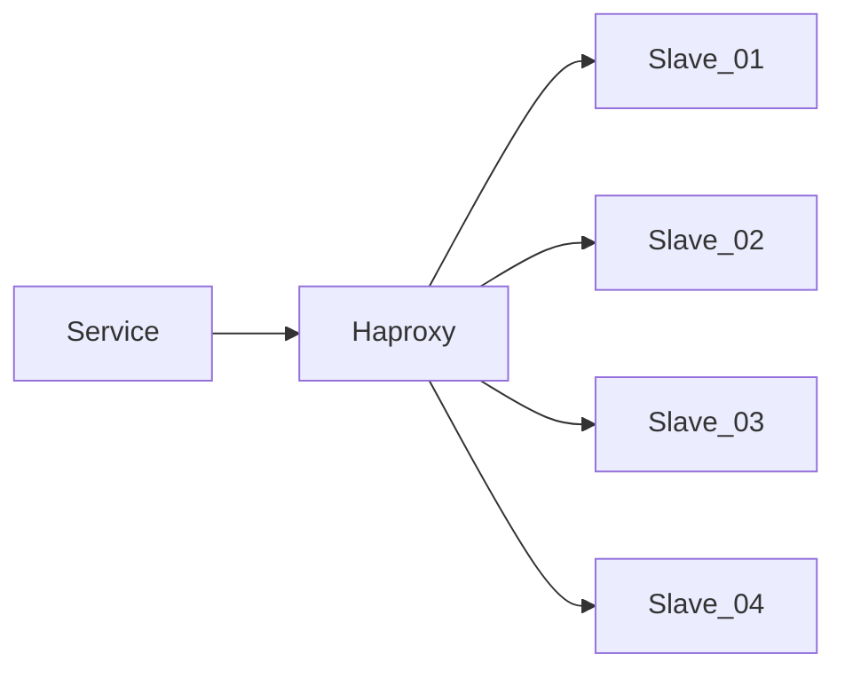

三、在生产环境中，应用程序是通过Haproxy来读取Slave集群，但是偶尔会产生 **SQLSTATE[HY000]: General error: 2006 MySQL server has gone away** 的错误，请根据经验，给出一排查方案与可能的方向，与开发一起定位问题, 现已经排查：
  - 故障发生时，服务器之间防火墙正常，服务器之间可以正常通信;
  - 故障SQL均可以正常查询，同时不存在性能问题;
  - 故障频率没有发现特别规律，与服务器负载没有正相关;
  - 查看各服务的日志，只发现了错误信息，但没有进一步的说明;




Solution:

没有接触过 HAProxy + MySQL，但可以尝试搜索相应解决方案.


以下为 ChatGPT 回答:
```
1. MySQL 配置和参数检查

    wait_timeout 和 interactive_timeout：这两个参数控制 MySQL 关闭空闲连接的时间，尤其是在高负载情况下，可能会因为连接空闲时间超出 wait_timeout 导致连接断开。检查并调整 wait_timeout 和 interactive_timeout 参数值。通常在 HAProxy 读取连接的环境下，建议适当延长这个超时时间。

bash

SHOW VARIABLES LIKE 'wait_timeout';
SHOW VARIABLES LIKE 'interactive_timeout';

    如果超时时间设置得较短（例如几分钟），则可以适当增加。例如将 wait_timeout 设置为 600 秒或更高。

2. HAProxy 配置排查

    timeout client 和 timeout server 设置：检查 HAProxy 的超时设置，timeout client 和 timeout server 参数决定了客户端和服务器的连接超时时间。确保这些参数与 MySQL 的超时时间相匹配，否则可能会在连接超时时，HAProxy 仍在等待，但 MySQL 已关闭连接。

HAProxy 配置示例：

haproxy

defaults
  timeout client  10m
  timeout server  10m

    连接池管理：HAProxy 使用连接池时，可能会持有 MySQL 已关闭的连接，检查是否启用了长连接并设置合理的连接保持时间。

解决方案：可以尝试在 MySQL 后端配置 option mysql-check 或者 option tcp-check 来定期检测后端的 MySQL 连接是否可用，并重新发起连接。
3. 应用层检查

    数据库连接重试机制：确保应用层实现了连接断开的重试逻辑。如果连接由于超时或其他原因断开，应用程序应尝试重新连接到 MySQL 而不是直接报错。
    长时间未使用的连接：检查是否有长时间未使用的连接被突然关闭的情况，如果是，则可能需要在应用层或中间层（如 HAProxy）添加连接的心跳机制或重连机制。

4. MySQL 资源限制

    max_allowed_packet 设置：有时 MySQL server has gone away 错误是由于传输的数据包过大而触发的。检查并增加 max_allowed_packet 参数值，例如：

bash

SHOW VARIABLES LIKE 'max_allowed_packet';
SET GLOBAL max_allowed_packet = 64M;  # 适当调大

5. 监控和日志分析

    网络监控：即便服务器之间通信正常，仍需要在发生故障时通过网络监控工具（如 Wireshark 或 tcpdump）分析实际的网络通信情况，查看是否有丢包、延迟或瞬时网络中断。
    HAProxy 和 MySQL 日志级别提升：在故障发生时提高 HAProxy 和 MySQL 的日志级别，检查是否有更详细的错误日志。你可以在 MySQL 中启用 general_log 或 slow_query_log 来记录所有执行的查询和连接状态。

6. MySQL Slave 服务器健康检查

    确保 Slave 服务器的健康状况良好，包括从库是否正常同步主库，磁盘是否存在 I/O 瓶颈，或资源（如 CPU、内存）是否充足。
    在 HAProxy 中加入 MySQL 的健康检查机制，确保在连接出错时可以自动切换到健康的从库节点。

7. 排查 Haproxy 与 MySQL 之间的连接池问题

    连接过多或过少：如果 HAProxy 使用了连接池，检查是否连接数过多或过少。过多的连接可能导致资源耗尽，过少的连接可能导致超时问题。根据负载情况，合理设置 maxconn 参数。

HAProxy 连接池配置示例：

haproxy

backend mysql-backend
  balance roundrobin
  server Slave_01 192.168.1.101:3306 check inter 2000 rise 2 fall 3
  server Slave_02 192.168.1.102:3306 check inter 2000 rise 2 fall 3

8. 数据库版本与驱动兼容性

    MySQL 驱动：检查应用程序使用的 MySQL 驱动是否与当前的 MySQL 版本完全兼容。某些版本的不兼容可能会导致意外断连，升级驱动或切换到官方推荐的驱动版本可能会有所帮助。

结论：

尽管网络、服务器负载、以及查询性能均未发现问题，但根据常见的 MySQL 断开连接的原因，超时、网络问题、HAProxy 配置、以及MySQL 参数不匹配是最可能的原因。可以从检查 MySQL 和 HAProxy 的超时参数入手，并确保应用层具备健全的重连和超时机制，同时使用健康检查功能。
```


## References:
- https://stackoverflow.com/questions/40076644/mysql-server-has-gone-away-error-constantly-appearing-with-haproxy
- https://dba.stackexchange.com/questions/132964/haproxy-mysql-lost-connection-to-mysql-server-during-query
- https://ming.theyan.gs/2024/01/%E6%88%91%E5%81%9A%E7%9A%84%E6%9F%90%E5%85%AC%E5%8F%B8%20DevOps%20%E8%BF%9C%E7%A8%8B%E8%81%8C%E4%BD%8D%E7%9A%84%E9%9D%A2%E8%AF%95%E9%A2%98/#A5